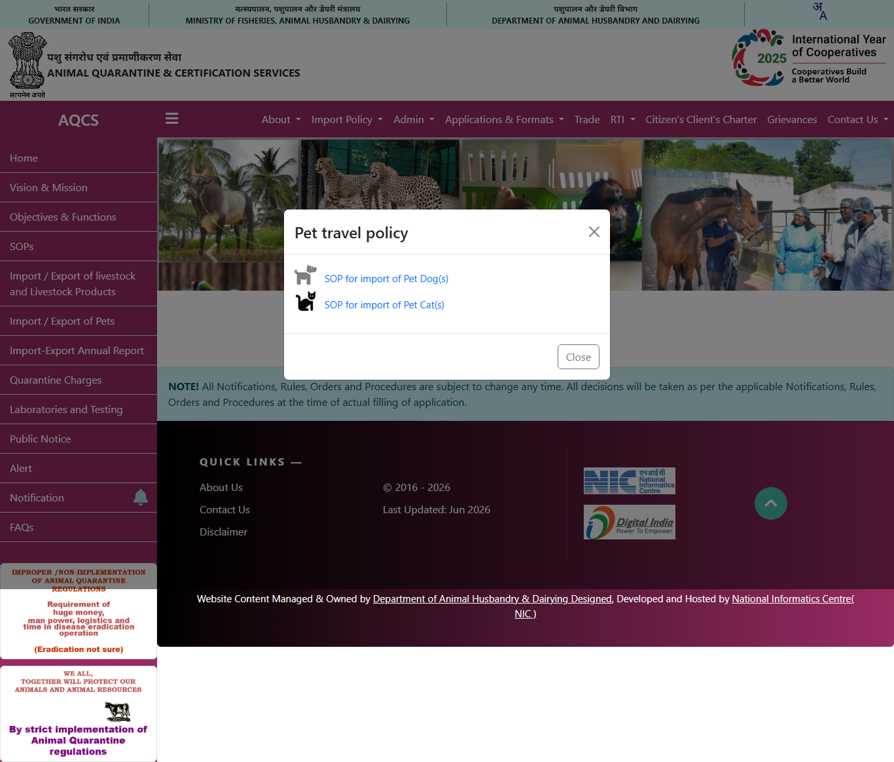

# Claim evidence ledger — routes-batch2

Verified 2026-06-09. Official sources only; every claim has a full-page screenshot on disk.

| Claim | Authority | Status | Evidence | Source |
|---|---|---|---|---|
| EU: microchip + rabies vaccination + EU animal health certificate; tit | European Commission | ✅ VERIFIED |  (1016KB) | [food.ec.europa.eu](https://food.ec.europa.eu/animals/live-animal-movements/dogs-cats-and-ferrets/bringing-pet-eu-non-eu-country_en) |
| Canada CFIA import requirements for pets; rabies vaccination; arrival  | Canada CFIA | ✅ VERIFIED |  (213KB) | [inspection.canada.ca](https://inspection.canada.ca/en/importing-food-plants-animals/pets) |
| India: import permit / NOC from the Animal Quarantine and Certificatio | India AQCS | ✅ VERIFIED |  (625KB) | [aqcsindia.gov.in](https://aqcsindia.gov.in/) |
| South Africa: state veterinary import permit + rabies titre + disease  | South Africa DALRRD | ⚠️ blocked | — | [www.dalrrd.gov.za](https://www.dalrrd.gov.za/) |

**3 verified (text-matched) · 0 captured · 1 blocked**, 3 screenshots saved in `audit/evidence/routes-batch2/`.