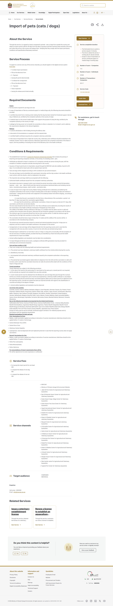

<!--
PAGE BRIEF (built by hand — Phase 3 manual run, 2026-05-29)
Keyword: "how much does the rabies titer test cost in Dubai"
Intent (Col J): Commercial · Primary fear (Col K): price gouging — no way to know if the quote is fair (Fear Hierarchy #3)
Page type: Cost Transparency Page · Depth level: 2 (Focused, 500–1,000 words)
Source Bank rows: C-001 (Unverifiable — MOCCAE silent on titer cost; HEDGED), C-003 (Verified — 500 AED release fee), C-015 (Conflicting — Etihad $399 vs community $1,500)
Screenshots: UAE-moccae-gov-C-001 (proof of silence), UAE-etihad-com-C-015 (the conflict)
-->

# How much does the rabies titer test cost in Dubai — and how to know if you're being overcharged

## Layer 1 — Fear acknowledgement
The most common worry we hear about cost is not "is it expensive" — it's *"I'm being quoted an insane amount and I have no way to know if it's fair."* One owner put it bluntly: *"relocation companies are shamelessly charging an insane amount of money."* This page gives you the only honest answer — what is officially published, what is not, and the numbers the community actually reports — so you can spot an unfair quote.

## Layer 2 — The verified answer (an honest "no official figure")
Here is the truth most pages won't tell you:

> **MOCCAE publishes no price for the rabies titer test.** The official import-of-pets page does not list a titer-test cost. *(Unverifiable — Source Bank C-001, checked 2026-05-28.)* So anyone quoting "the official price" is not citing an official source — there isn't one.

What **is** officially published:
- **The MOCCAE release fee is 500 AED per dog (250 AED per cat).** *(Verified — Source Bank C-003.)*

What the **community** consistently reports (treat as a sanity-check range, not gospel):
- Rabies titer test: **700–1,300 AED**, with reports that only a limited number of UAE labs process it and a 2–3 week wait.

## Layer 3 — Evidence (silence is proof)

*This is the official MOCCAE page in full — note it says nothing about a titer-test price. The absence is the proof: any "official price" quote is not from here.*

**A real price conflict worth knowing:** community chatter put the Etihad cabin-pet fee at USD 1,500; the **official Etihad pets page shows a USD 399 promotional fee** — not 1,500. *(Conflicting — Source Bank C-015.)* Always check the operator's own page before accepting a number.

## Layer 4 — Related fears
- *Worried the whole process is opaque?* → Pre-flight document checklist (Process Guide). **[required page]**
- *Worried about being held at the airport over paperwork?* → What happens if your dog is taken at Dubai airport (Fear Resolution).
- *Choosing a provider?* → Sharjah vs Dubai vs Abu Dhabi airport (Comparison).

## Layer 5 — Help-first CTA
**Check a quote against the verified cost breakdown** — what's officially published, what's community-sourced, and the range that signals an unfair price.

<!-- Verification (File 03): G1 ✓ · G2 the headline figure is Unverifiable and is HEDGED (not asserted); verified release fee cited; Etihad conflict shown ✓ · G3 MOCCAE silence screenshot ✓ · G4 links ✓ · G5 help-first (cost-check) ✓ · G6 one fear (price gouging) ✓ · G7 ✓ · depth L2 ✓ -->
